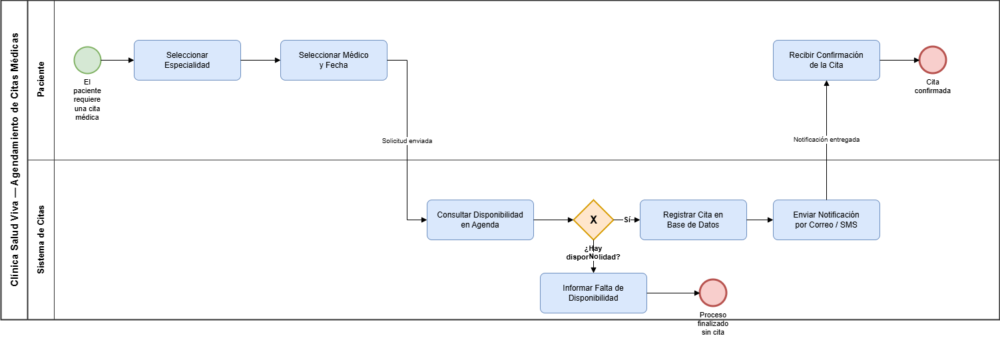

# 📄 Informe Técnico del Taller

## 🔖 Nombre del Taller

Taller 1 — Modelado de Procesos de Negocio con BPMN

## 👥 Integrantes del equipo

- Juan Pablo Luna Zuleta
- Alejandro Riveros Sobrina
- Martin Ortega Solito

## 🧠 Descripción general del trabajo

El objetivo del taller fue modelar un proceso de negocio real usando la notación BPMN, identificando actores, eventos, actividades, puntos de decisión y los flujos que los conectan. El caso base trabajado en clase fue el **Agendamiento de Citas Médicas de la Clínica Salud Viva**, una institución de tamaño medio que atiende de forma presencial y virtual, y que cuenta con una plataforma digital donde los pacientes agendan citas, reciben notificaciones y consultan su historial.

La actividad se desarrolló siguiendo la metodología de cinco pasos propuesta en la guía del taller: primero identificar quién participa, luego delimitar el proceso con su evento de inicio y sus posibles desenlaces, inventariar las actividades por actor, insertar los puntos de decisión y, por último, conectar y validar todo el diagrama contra la checklist de autoevaluación. El resultado es un modelo digitalizado en `clase/modelo.drawio`, construido en draw.io.

## 🔧 Proceso de desarrollo

Empezamos por lo que la guía advierte que no se debe hacer al final: definir los actores. Discutimos si el proceso debía tener dos o tres carriles. Consideramos separar "Base de Datos" y "Servicio de Notificaciones" como participantes independientes, pero decidimos no hacerlo: ninguno de los dos toma decisiones ni ejecuta trabajo autónomo, son componentes internos del sistema de citas. Modelarlos como carriles habría inflado el diagrama sin agregar información de negocio. Quedaron entonces dos carriles: **Paciente** y **Sistema de Citas**.

El segundo paso fue delimitar el proceso. Acordamos que el disparador es el momento en que el paciente necesita atención médica, no el clic en la plataforma, porque el clic ya es una actividad. Los desenlaces posibles resultaron dos: la cita queda confirmada, o no hay disponibilidad y el proceso termina sin cita. Definir esto antes de dibujar actividades nos evitó el error más común de la rúbrica, que es dejar caminos sin evento de fin.

Con el marco listo listamos las actividades carril por carril, todavía sin flechas. Aquí ajustamos la redacción varias veces: teníamos "Disponibilidad" y "Confirmación" como nombres de tarea, y los reescribimos como verbos de acción — "Consultar Disponibilidad en Agenda", "Recibir Confirmación de la Cita" — siguiendo la convención verbo + sustantivo que exige la checklist.

El cuarto paso fue el gateway. Solo encontramos un punto real de bifurcación: **¿Hay disponibilidad?**, un gateway exclusivo (XOR) porque las dos ramas son mutuamente excluyentes. Evaluamos agregar un segundo gateway para un reintento ("¿Desea buscar otra fecha?") que devolviera el flujo a la selección de médico. Lo descartamos en esta versión por dos razones: el enunciado del caso no menciona reintento, y el bucle obligaba a cruzar líneas sobre la rama afirmativa, lo que penaliza el criterio de claridad del diagrama. Queda documentado como extensión natural del modelo.

Finalmente conectamos todo con flujos de secuencia, etiquetamos las salidas del gateway con "Sí" y "No", y validamos contra la checklist. La herramienta usada fue **draw.io (diagrams.net)**, sobre formas base (elipse, rectángulo redondeado, rombo, pool/lane) en lugar de la librería BPMN completa, para que el archivo sea editable por cualquier integrante sin dependencias de plantilla.

## 🧩 Análisis del modelo propuesto

### Cómo se estructura el modelo entregado

El modelo es un único pool, *Clínica Salud Viva — Agendamiento de Citas Médicas*, dividido en dos carriles horizontales. La lectura es de izquierda a derecha y el flujo alterna entre carriles tres veces, lo que refleja la naturaleza conversacional del proceso: el paciente pide, el sistema responde, el paciente recibe.

| Elemento | Cantidad | Detalle |
|---|---|---|
| Pool | 1 | Agendamiento de Citas Médicas |
| Carriles (lanes) | 2 | Paciente, Sistema de Citas |
| Evento de inicio | 1 | El paciente requiere una cita médica |
| Actividades | 7 | 3 del paciente, 4 del sistema |
| Gateway exclusivo (XOR) | 1 | ¿Hay disponibilidad? |
| Eventos de fin | 2 | Cita confirmada / Proceso finalizado sin cita |
| Flujos de secuencia | 10 | Todos etiquetados donde salen de un gateway |

El camino feliz recorre: inicio → Seleccionar Especialidad → Seleccionar Médico y Fecha → Consultar Disponibilidad en Agenda → gateway → (Sí) Registrar Cita en Base de Datos → Enviar Notificación por Correo/SMS → Recibir Confirmación de la Cita → **Cita confirmada**. La rama negativa recorre: gateway → (No) Informar Falta de Disponibilidad → **Proceso finalizado sin cita**.

### Cómo representa las necesidades del cliente

El enunciado del caso define el flujo como *selección de especialidad → médico → fecha → confirmación*, con interacciones hacia el sistema de citas, la base de datos y el canal de notificación por correo o SMS. Cada uno de esos elementos tiene una representación explícita en el modelo:

- La secuencia de selección se dividió en dos tareas del paciente en lugar de una sola, porque en la plataforma real son pantallas distintas y la especialidad condiciona qué médicos se ofrecen.
- La interacción con la base de datos quedó como la tarea *Registrar Cita en Base de Datos*, dentro del carril del sistema. Se modeló como actividad y no como participante para no confundir un componente técnico con un actor de negocio.
- El requisito de notificación por correo o SMS quedó en la tarea *Enviar Notificación por Correo/SMS*. El canal específico se dejó sin bifurcar porque es una configuración de preferencia del usuario, no una decisión del proceso; abrir un gateway ahí agregaría ruido sin cambiar el desenlace.
- La atención en épocas de alta demanda (campañas de vacunación, jornadas preventivas) es justamente el escenario donde la rama "No" se vuelve frecuente, lo que refuerza la decisión de modelarla como un desenlace de primera clase y no como una excepción implícita.

### Supuestos tomados

1. El paciente ya está registrado y autenticado en la plataforma; el registro de usuario es un proceso aparte, fuera del alcance de este modelo.
2. La validación de la afiliación con la aseguradora ocurre fuera de este proceso o se asume aprobada; el caso menciona alianzas con aseguradoras pero no las incorpora al flujo de agendamiento.
3. La consulta de disponibilidad es sincrónica: el sistema responde en la misma sesión y no hay espera asíncrona que justifique un evento intermedio de temporizador.
4. La notificación se considera entregada al enviarse; no se modela reintento por fallo de correo o SMS.
5. El proceso cubre únicamente el agendamiento. La atención médica, la cancelación y la reprogramación son procesos independientes.
6. Cuando no hay disponibilidad el proceso termina. Un reintento del paciente se interpreta como una nueva instancia del proceso, no como un bucle interno.

## 📈 Diagrama final entregado

> Archivo fuente editable: `clase/modelo.drawio`. La imagen se exporta desde draw.io con *File → Export as → PNG* (fondo blanco, zoom 200%, borde 10 px) y se guarda como `img/Diagrama.png`.

## 📋 Tabla de actores, entidades o componentes

| Nombre del elemento | Tipo | Descripción | Responsable |
|---------------------|------|-------------|-------------|
| Paciente | Actor (carril) | Usuario que solicita la cita, selecciona especialidad, médico y fecha, y recibe la confirmación | Cliente externo |
| Sistema de Citas | Actor / sistema (carril) | Plataforma digital que consulta la agenda, registra la cita y dispara las notificaciones | Clínica Salud Viva — TI |
| El paciente requiere una cita médica | Evento de inicio | Dispara el proceso cuando surge la necesidad de atención | Paciente |
| Seleccionar Especialidad | Actividad | El paciente elige la especialidad médica requerida | Paciente |
| Seleccionar Médico y Fecha | Actividad | El paciente escoge profesional y franja horaria de su preferencia | Paciente |
| Consultar Disponibilidad en Agenda | Actividad | El sistema verifica cupos contra la agenda del médico seleccionado | Sistema de Citas |
| ¿Hay disponibilidad? | Gateway exclusivo (XOR) | Punto de decisión que bifurca hacia confirmación o cierre sin cita | Sistema de Citas |
| Registrar Cita en Base de Datos | Actividad | Persiste la cita y bloquea el cupo en la agenda | Sistema de Citas |
| Enviar Notificación por Correo/SMS | Actividad | Emite la confirmación por el canal configurado por el paciente | Sistema de Citas |
| Recibir Confirmación de la Cita | Actividad | El paciente recibe y verifica los datos de su cita | Paciente |
| Informar Falta de Disponibilidad | Actividad | El sistema comunica que no hay cupos para la combinación solicitada | Sistema de Citas |
| Cita confirmada | Evento de fin | Desenlace exitoso del proceso | — |
| Proceso finalizado sin cita | Evento de fin | Desenlace sin agendamiento por falta de disponibilidad | — |
| Base de datos de citas | Componente de soporte | Almacena citas, agendas y disponibilidad. No se modela como carril por ser un componente interno del sistema | Clínica Salud Viva — TI |
| Canal de notificación (correo/SMS) | Componente de soporte | Servicio de mensajería usado por el sistema para confirmar | Proveedor externo / TI |

## 🔍 Investigación complementaria

### Tema investigado

Buenas prácticas de modelado BPMN: convenciones de nomenclatura, uso correcto de pools y carriles, y criterios de legibilidad para producir modelos que se entiendan sin explicación verbal.

### Resumen

Al revisar cómo se modela BPMN en la práctica encontramos una distinción que nos resultó clave: un diagrama puede ser sintácticamente válido y aun así ser un mal modelo. La validez tiene que ver con usar los símbolos correctos y conectarlos de forma permitida; la calidad tiene que ver con si alguien que no participó en el modelado entiende el proceso con solo mirarlo. De ahí salieron tres reglas prácticas que aplicamos en la fase de validación: nombrar toda actividad con verbo en infinitivo más objeto, etiquetar todas las salidas de cada gateway, y garantizar que ningún camino quede sin evento de fin. Las tres coinciden con la checklist del taller, lo que nos confirmó que no son criterios arbitrarios del curso sino convenciones extendidas.

El segundo punto que investigamos fue la diferencia entre pool y carril, porque era la duda concreta que teníamos al empezar. La conclusión es que un pool representa un participante independiente que se comunica con otros por mensajes, mientras que un carril subdivide a un mismo participante en roles internos que comparten el flujo de secuencia. La consecuencia práctica es que un flujo de secuencia nunca debería cruzar el borde de un pool. Eso justificó nuestra decisión: el Paciente y el Sistema de Citas quedaron como carriles de un solo pool porque el flujo entre ellos es continuo y está orquestado por la clínica. Si hubiéramos incluido a la aseguradora, esa sí habría correspondido a un pool aparte conectado por flujo de mensaje, por ser una organización externa con su propio proceso.

El tercer aspecto fue la legibilidad. Las recomendaciones más repetidas apuntan a mantener el diagrama dentro de lo que cabe en una pantalla, evitar cruces de líneas y descomponer en subprocesos antes que saturar un solo nivel. Esto respalda directamente el descarte del gateway de reintento: lo que ganábamos en completitud lo perdíamos en claridad por el bucle. También reforzamos una idea que veníamos aplicando sin nombrarla: los gateways no ejecutan trabajo, solo enrutan, y por eso la evaluación de la condición debe ocurrir en la actividad anterior. Ese es el motivo de que *Consultar Disponibilidad en Agenda* vaya antes del gateway *¿Hay disponibilidad?* y no al revés, que sería modelar una decisión sin la tarea que produce el dato con el que se decide.

---

_Este documento hace parte de la entrega del Taller 1 del curso AREM (Arquitectura Empresarial) - Universidad de La Sabana._
